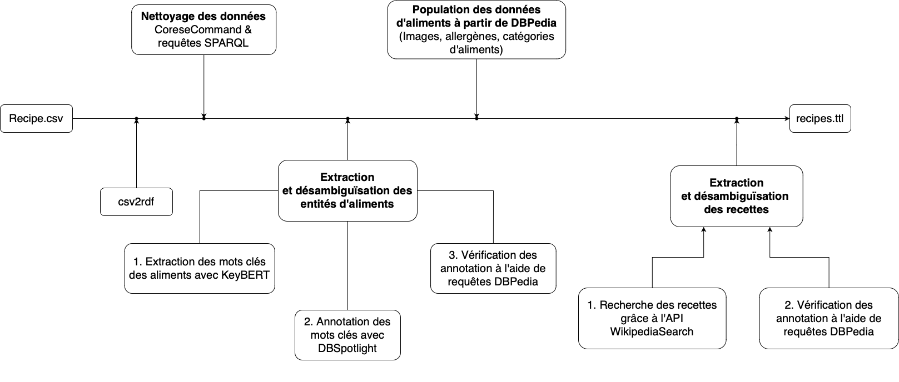

Dans le cadre de notre projet, nous avons décidé de développer une application permettant aux utilisateurs 
de découvrir et de choisir des recettes de cuisine adaptées, en fonction de leur régime alimentaire et 
des ingrédients dont ils disposent.
Pour cela, nous avons récupéré et structuré les données de plusieurs sources,
afin de créer un ensemble cohérent, comportant toutes les informations nécessaires aux fonctionnalités souhaitées.

## Description et spécifications de l’application

Notre application propose une interface permettant aux utilisateurs de découvrir facilement de nouvelles recettes. 
Grâce à une fonction de recherche avancée, ils peuvent trouver des recettes par nom, ingrédients, ou en utilisant des filtres spécifiques. 
Cette fonctionnalité est particulièrement utile pour ceux qui souhaitent sélectionner des recettes en fonction de leurs préférences alimentaires, 
telles que des options végétariennes.

Lorsqu'une recette est sélectionnée,
l'utilisateur est dirigé vers une page détaillée présentant les informations usuelles des recettes telles que 
le titre, la liste d'instructions, et une image si celle-ci est disponible sur DBPedia.
La page inclut également une liste complète des ingrédients,
avec leurs quantités et unités respectives. Ces dernières peuvent être aisément converties entre les systèmes métrique et impérial.

Finalement, la page fournit des informations nutritionnelles adaptées à la recette et aux quantités d'ingrédients indiquées.

## Modélisation et contraintes sur les données

Pour représenter nos données, nous avons commencé par créer plusieurs vocabulaires et thésaurus.
Nous avons d’abord créé le vocabulaire le plus général du projet,
qui permet de définir les classes :Food, :Recipe, :Quantity et :Ingrédient, ainsi que les relations des recettes.
Chaque recette est le sujet de plusieurs relations que nous avons défini dans ce vocabulaire.
Les instructions d’une recette sont définies avec la relation :instructions et le nom 
de la recette est lié à la relation :name. Lorsque que cela est possible,
la miniature d’une recette est renseignée avec la relation :hasThumbnail
et un lien vers l'entrée Dbpedia de la recette est lié avec la relation :hasDbpediaLink.
La catégorie d’une recette est définie comme la classe de la recette.

Dans le vocabulaire, nous avons défini la plupart des catégories de plats sous forme de classes,
réparties dans une hiérarchie. Par exemple, la catégorie :Appetizer contient la catégorie :SaladsAndDressings.
Cela permet à d’autres utilisateurs de réutiliser facilement les catégories de ce vocabulaire 
pour d'autres projets si cela est nécessaire. De plus, nous avons aligné ce vocabulaire 
avec les catégories de plats dans dbpedia et dans le vocabulaire fowl,
pour le rendre interopérable plus facilement avec d’autres vocabulaires.

Les ingrédients d’une recette sont définis par la relation :hasIngredient.
Chaque ingrédient est représenté par une node anonyme.
Cette node anonyme est reliée à un nom par la relation :name,
relié à une nourriture lorsque cela est possible grâce à la relation food:food 
et reliée à la quantité et l’unité grâce à une autre node anonyme par les propriétées :hasStandardMeasurementUnit ,
:hasImperialMeasurementUnit ou :hasMetricMeasurementUnit.

Nous avons ensuite deux thésaurus de plus, permettant de définir les unités et la nourriture.
Le thésaurus des unités, défini avec le préfix measurements nous a permis de définir les unités et de les diviser en trois groupes.
Les deux premiers groupes contiennent les unités du système métrique et les unités du système impérial.
Les unités de ces deux groupes peuvent être converties d’un système vers l’autre, grâce à la relation :hasUnitConversion.
Le sujet de cette relation doit être une node anonyme,
qui contient l’unité vers laquelle convertir ainsi que le ratio permettant de passer d’une unité à l’autre.
Le troisième groupe contient les unités dites standards, qui n’ont pas besoin d’être converties,
comme les tasses, les pincées et les tranches. Ces mesures n’ont donc pas de relation :hasUnitConversion associée.
Ce thésaurus contient également trois quantités indéfinies,
lorsque de la granularité est nécessaire, mais qu’une quantité exacte ne peut pas être renseignée.

Le dernier thésaurus est celui sur la nourriture.
Ce thésaurus est défini par le préfix food et désigne les aliments.
Ce thésaurus contient toutes les grandes catégories d’aliments, comme la viande,
désignée par food:Meat et food:DairyProduct, qui désigne les produits laitiers.
Les aliments sont désignés par les classes, comme les fruits à coque, les céréales,
les pâtes et les épices. En utilisant ces classes,
nous pouvons utiliser OWL pour inférer les recettes correspondantes a certains régimes spécifiques,
que nous pouvons utiliser pour filtrer les recettes dans l’application.

Une fois le vocabulaire et les thésaurus définis,
nous avons pu utiliser OWL pour ajouter automatiquement plusieurs relations.
Nous nous sommes par exemple servis d’un property axiom pour ajouter à chaque recette les ingrédients utilisés,
et nous avons inféré l’inverse de cette propriété,
ce qui permet à chaque ingrédient de savoir dans quelle recette il est utilisé.
Cela permet notamment de simplifier les requêtes servant à faire les recherches.

Pour s’assurer que les structures de données répondaient à la forme souhaitée,
nous avons  également imposé des contraintes à l’aide de SHACL.
Cela permet par exemple de s’assurer que les objets d’une relation :hasUnitConversion 
ont un ratio de conversion qui est un nombre décimal qui n’est pas 0, ce qui évite les divisions par 0. 

Cela permet également de vérifier la structure des recettes et des ingrédients.
Par exemple, nous vérifions que les quantités soient des nombres décimaux non nuls,
ou l’une des valeurs correspondant aux quantités indéfinies que nous avons déclarées dans le thésaurus Measurements.
Cela nous permet aussi de vérifier que l’unité liée à la quantité d’un ingrédient 
est une IRI qui correspond à une unité dans le thésaurus Measurements.
Pour vérifier cette condition, nous pouvons utiliser la propriété sh:pattern 
qui permet de limiter les URI possibles qu’aux URI qui désignent des unités.

## Traitement des données 

Pour avoir toutes les informations nécessaires à la réalisation de notre application,
nous avons utilisé plusieurs sources de données, et fait de nombreux traitements sur ces données,
afin de les standardiser pour les rendre exploitables.

### Extraction et Mise en forme depuis le CSV

Pour commencer, nous avons lifté les données d’un CSV contenant une liste de recettes en utilisant csv2rdf.
Le CSV choisi ( https://github.com/cweber/cookbook/blob/master/recipes.csv ) décrit chaque recette avec une colonne pour le nom,
une colonne pour la catégorie de recettes et une colonne avec les instructions.
Les quantités, ingrédients et unités sont décrits dans les colonnes ‘UnitX’,
’IngredientX’ et ‘QuantityX’, ou X est un nombre entre 1 et 19.
Les données dans ces colonnes sont toutes des chaînes de caractères ou Null.

Une fois les données insérées dans un graph RDF avec csv2rdf,
nous les avons transformées pour pouvoir les utiliser.
Pour traiter ces données, nous avons utilisé Corese-command pour faire de multiples requêtes CONSTRUCT sur les données.
La première chose a été de créer les nodes anonymes désignant les ingrédients,
qui regroupent un aliment, une quantité et une unité.
Nous pouvons ensuite supprimer tous les ingrédients sans noms,
ce qui évite les nombreuses nodes anonymes du aux colonnes Null dans le CSV.

Une fois cela fait, il a fallu standardiser les unités et les quantités.
Idéalement, toutes les quantités devraient être exprimées comme un nombre décimal,
et toutes les unités devraient être un concept RDF défini dans le thésaurus Measurements.
Pour ce faire, nous avons d’abord utilisé des expressions régulières pour extraire la quantité de l’unité lorsque cela était nécessaire.
Par exemple l'unité “6 oz. pkg.” contient à la fois l’unité,
measurements:WeightOunce et la quantité, 6.
Nous extrayons donc cette quantité, que nous mappons à la relation :quantityFromUnit de façon temporaire. 

Nous avons ensuite utilisé des regex pour remplacer les chaînes de caractères par un 
maximum d'unités existantes dans le thésaurus Measurements.
	
Nous pouvons ensuite convertir les chaînes de caractères des quantités en unités.
Pour cela, nous utilisons encore une fois des regex pour pouvoir récupérer les quantités.
En effet, le CSV contient des quantités sous différents formats qu’il faut prendre en compte,
comme par exemple “1.5”, “1 ½” et “3/2”.  
Nous avons également introduit des quantités indéfinies,
qui sont measurements:Few, measurements:Some et measurements:Many,
pour pouvoir mapper les quantités indéfinies dans le CSV comme “a few”.
Cela permettra de pouvoir les convertir du système métrique au système impérial et vice versa.

Une fois les unités et les quantités définies,
nous pouvons multiplier les quantités par le champ :quantityFromUnit récupéré précédemment,
et séparer les unités selon leur système de mesures. Cela permet d’identifier rapidement les unités impériales,
ou standards, ce qui nous permet d’utiliser un CONSTRUCT pour ajouter facilement 
les quantités et unités converties dans un autre système de mesure, en utilisant la propriété :conversionRatio.

La dernière étape pour le CSV est de mapper la colonne Catégorie aux catégories dans le vocabulaire.
Une fois cela fait, nous pouvons définir la catégorie comme le type des recettes.

### Extraction de mots-clés, désambiguation et linking

Nous avons ensuite utilisé Dbpedia Spotlight pour identifier les nourritures désignées par le nom des ingrédients.

Pour cela, nous avons récupéré le nom de chaque ingrédient que nous avons fourni à dbpedia pour essayer de reconnaître une entité.
La difficulté de cette étape vient du fait que les noms sont susceptibles de contenir plusieurs entitées.
Dans ce cas, nous sélectionnons l’entité avec le support le plus important  et qui est de la nourriture.
Pour vérifier que l’entité est une nourriture,
nous cherchons dans dbpedia à l'aide d’une requête fédérée si l’entité est un ingrédient d’une recette,
ou défini avec le type dbo:Food.

Cela nous a permis d’ajouter une nourriture pour tous les ingrédients que nous avons reconnu.
Ceux-ci nous permettront ensuite de catégoriser les recettes en fonction de ce qu’elles contiennent. 

Nous nous servons également de dbpedia pour ajouter des informations sur les recettes lorsque cela est possible.
Nous recherchons dans le nom de la recette dans dbpedia. Si celui-ci est trouvé,
nous lions notre recette à la recette dans dbpedia, et nous ajoutons à notre recette la miniature

### Ajout de données depuis DBPedia

### Inférence sur les données

Au démarrage du serveur, en plus d’ajouter les unités converties depuis un système de mesure vers un autre,
nous ajoutons automatiquement un type aux recettes grâce aux inférences OWL. 
	
En effet, en utilisant la nourriture que nous avons ajouté aux ingrédients,
nous pouvons tirer avantage des classes définies avec OWL pour trouver les classes qui contiennent de la viande,
des produits laitiers, des noix, des arachides et des produits d’origine animale.

En utilisant les compléments de ces recettes, grâce à :complementaryRecipe,
nous pouvons facilement définir toutes les recettes qui ne comportent pas un ingrédient.
Par exemple, en définissant les recettes qui contiennent de la viande et du poisson comme :RecipeWithMeatOrFish,
nous pouvons utiliser le complément pour définir :VegetarianRecipe.

La propriété owl:complementOf aurait permis de faire le complément sans définir une nouvelle relation. Cependant,
owl:complementOf n’existe que dans OWL DL. Nous avons donc créé cette relation,
et nous avons ajouté l’inférence de cette relation à l’aide d’une requête INSERT sur notre graph.
Cela permet d'étendre le fonctionnement de OWL pour prendre en charge un comportement qui n’aurait pas été possible sinon,
puisque Corese ne supporte pas OWL DL.

Définir ces catégories de recettes permet de proposer simplement des filtres à l'utilisateur.	

### Requête fédérée

Pour compléter les données affichées à l'utilisateur,
nous avons utilisé à la fois un microservice SPARQL pour récupérer les données de l’API CalorieNinjas et un endpoint Dbpédia.

Pour pouvoir afficher les informations nutritionnelles de la recette,
nous avons fait un microservice qui utilise CalorieNinjas pour récupérer 
toutes les informations nutritionnelles des ingrédients en fonction de la quantité,
et qui les additionne les valeurs des ingrédients,
pour avoir entre autres, la quantité de sucre ou le nombre de calories de la recette.

Pour faire appel à ce microservice de façon dynamique,
au moment où le serveur demande une recette, nous faisons deux requêtes SPARQL. 

La première requête construit l’URL  avec les quantités et le nom de chaque ingrédient,
que nous devons concaténer dans l’URL.
Cette requête a également la responsabilité de récupérer la liste des unités et des 
quantités dans le système impérial et dans le système métrique. 

Une fois cette URL construite,
nous pouvons l’utiliser pour faire appel au micro service pour récupérer les informations 
nutritionnelles de la recette quand la deuxième requête. Dans celle-ci,
nous utilisons également un endpoint SPARQL de Dbpedia,
qui nous permet de récupérer si cela existe, un commentaire permettant de décrire la recette. 

## Annexes

